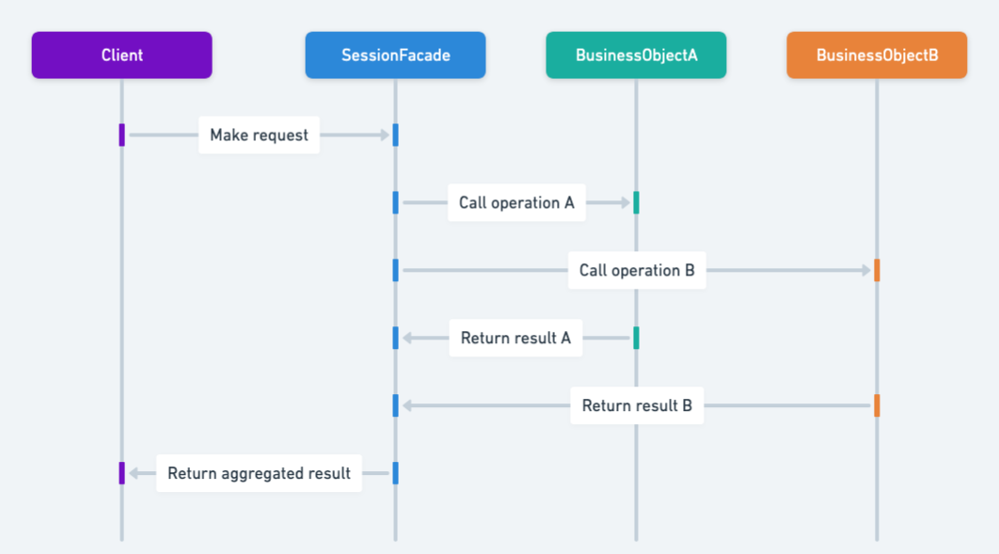

## Also known as

* Session Facade 

## Intent of Session Facade Design Pattern

Abstracting the underlying business object interactions by providing a service layer that exposes only the required interfaces  

## Detailed Explanation of Session Facade Pattern with Real-World Examples

Real-world example

> In an e-commerce website, users interact with several subsystems like product catalogs, shopping carts, 
> payment services, and order management. The Session Facade pattern provides a simplified, centralized interface for these subsystems, 
> allowing the client to interact with just a few high-level methods (e.g., addToCart(), placeOrder(), selectPaymentMethod()), instead of directly communicating with each subsystem, using a facade supports low coupling between classes and high cohesion within each service, allowing them to focus on their specific responsibilities.

In plain words

> The Session Facade design pattern is an excellent choice for decoupling complex components of the system that need to be interacting frequently. 

Sequence diagram



## Programmatic Example of Session Facade Pattern in Java

The Session Facade design pattern is a structural design pattern that provides a simplified interface to a set of complex subsystems, reducing the complexity for the client. This pattern is particularly useful in situations where the client needs to interact with multiple services or systems but doesn’t need to know the internal workings of each service.

In the context of an e-commerce website, imagine a system where users can browse products, add items to the shopping cart, process payments, and place orders. Instead of the client directly interacting with each individual service (cart, order, payment), the Session Facade provides a single, unified interface for these operations.

Example Scenario:
In this example, the ShoppingFacade class manages interactions with three subsystems: the `CartService`, `OrderService`, and `PaymentService`. The client interacts with the facade to perform high-level operations like adding items to the cart, placing an order, and selecting a payment method.

Here’s a simplified programmatic example:
```java
public class App {
    public static void main(String[] args) {
        ShoppingFacade shoppingFacade = new ShoppingFacade();
        shoppingFacade.addToCart(1);
        shoppingFacade.order();
        shoppingFacade.selectPaymentMethod("cash");
    }
}
```

The `ShoppingFacade` acts as an intermediary that facilitates interaction between different services promoting low coupling between these services. 
```java
public class ShoppingFacade {
    
    private final CartService cartService;
    private final OrderService orderService;
    private final PaymentService paymentService;
    
    public ShoppingFacade() {
        Map<Integer, Product> productCatalog = new HashMap<>();
        productCatalog.put(1, new Product(1, "Wireless Mouse", 25.99, "Ergonomic wireless mouse with USB receiver."));
        productCatalog.put(2, new Product(2, "Gaming Keyboard", 79.99, "RGB mechanical gaming keyboard with programmable keys."));
        Map<Integer, Product> cart = new HashMap<>();
        cartService = new CartService(cart, productCatalog);
        orderService = new OrderService(cart);
        paymentService = new PaymentService();
    }
    
    public Map<Integer, Product> getCart() {
        return this.cartService.getCart();
    }
    
    public void addToCart(int productId) {
        this.cartService.addToCart(productId);
    }

   
    public void removeFromCart(int productId) {
        this.cartService.removeFromCart(productId);
    }
    
    public void order() {
        this.orderService.order();
    }
    
    public Boolean isPaymentRequired() {
        double total = this.orderService.getTotal();
        if (total == 0.0) {
            LOGGER.info("No payment required");
            return false;
        }
        return true;
    }
    
    public void processPayment(String method) {
        Boolean isPaymentRequired = isPaymentRequired();
        if (Boolean.TRUE.equals(isPaymentRequired)) {
            paymentService.selectPaymentMethod(method);
        }
    }
```

Console output for starting the `App` class's `main` method:

```
19:43:17.883 [main] INFO com.iluwatar.sessionfacade.CartService -- ID: 1
Name: Wireless Mouse
Price: $25.99
Description: Ergonomic wireless mouse with USB receiver. successfully added to the cart
19:43:17.910 [main] INFO com.iluwatar.sessionfacade.OrderService -- Client has chosen to order [ID: 1
```

This is a basic example of the Session Facade design pattern. The actual implementation would depend on specific requirements of your application.

## When to Use the Session Facade Pattern in Java

* Use when building complex applications with multiple interacting services, where you want to simplify the interaction between various subsystems.
* Ideal for decoupling complex systems that need to interact but should not be tightly coupled.
* Suitable for applications where you need a single point of entry to interact with multiple backend services, like ecommerce platforms, booking systems, or order management systems.

## Real-World Applications of Server Session Pattern in Java

* Enterprise JavaBeans (EJB)
* Java EE (Jakarta EE) Applications

## Benefits and Trade-offs of Server Session Pattern


* Simplifies client-side logic by providing a single entry point for complex operations across multiple services.
* Decouples components of the application, making them easier to maintain, test, and modify without affecting other parts of the system.
* Improves modularity by isolating the implementation details of subsystems from the client.
* Centralizes business logic in one place, making the code easier to manage and update.

## Trade-offs:

* Potential performance bottleneck: Since all requests pass through the facade, it can become a bottleneck if not optimized.
* Increased complexity: If the facade becomes too large or complex, it could counteract the modularity it aims to achieve.
* Single point of failure: If the facade encounters issues, it could affect the entire system's operation, making it crucial to handle errors and exceptions properly.

## Related Java Design Patterns

* [Facade](https://java-design-patterns.com/patterns/facade/): The Session Facade pattern is a specific application of the more general Facade pattern, which simplifies access to complex subsystems.
* [Command](https://java-design-patterns.com/patterns/command/): Useful for encapsulating requests and passing them to the session facade, which could then manage the execution order.
* [Singleton](https://java-design-patterns.com/patterns/singleton/):  Often used to create a single instance of the session facade for managing the entire workflow of a subsystem.

## References and Credits

* [Core J2EE Patterns: Best Practices and Design Strategies](https://amzn.to/4cAbDap)
* [Design Patterns: Elements of Reusable Object-Oriented Software](https://amzn.to/3w0pvKI)
* [Patterns of Enterprise Application Architecture](https://amzn.to/3WfKBPR)
